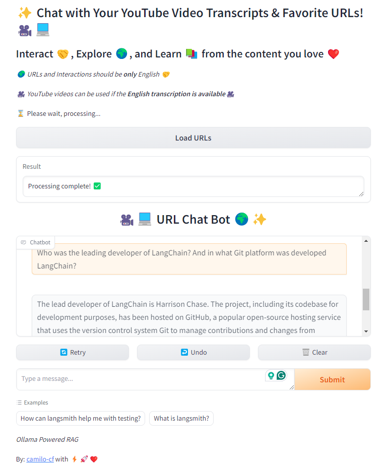
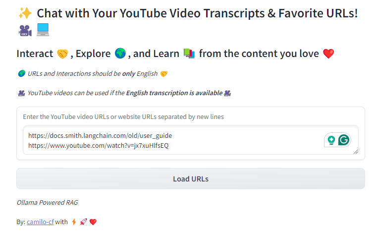
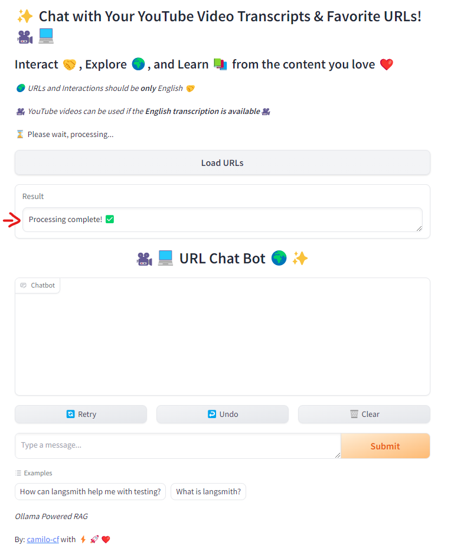
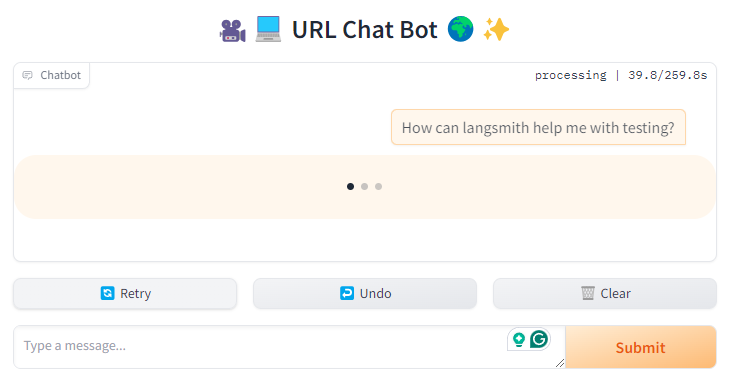
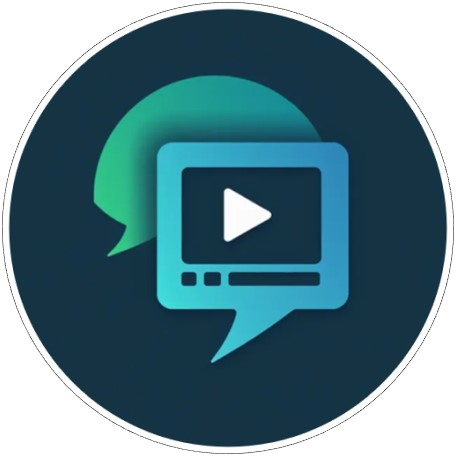
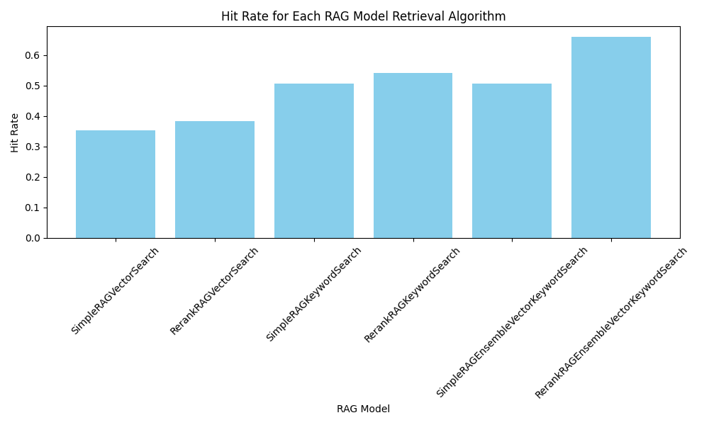
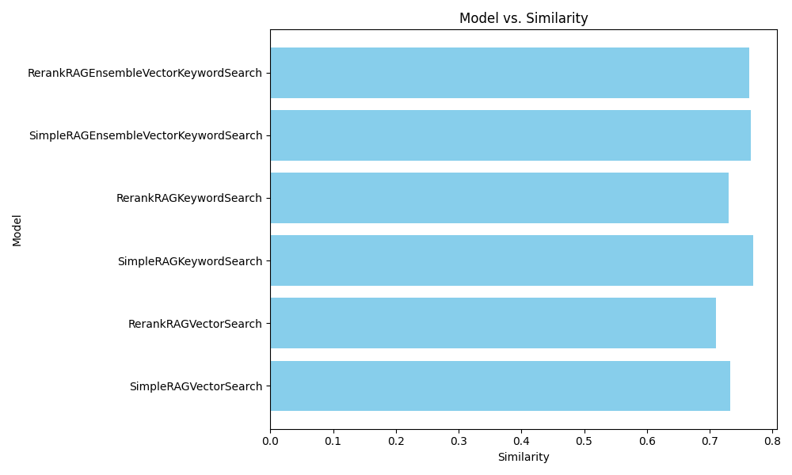

# Interactive Video Transcript and URL Chatbot - RAG

<div style="text-align: center;">
    
</div>


This project was implemented for [LLM Zoomcamp](https://github.com/DataTalksClub/llm-zoomcamp) - a free course about LLMs and RAG.

## Expected Usage
1. Gather you YouTube video URLs and website URLs
2. Paste them in the given box separated by new lines

<div style="text-align: center;">
    
</div>

3. Click the Load URLs button
4. Wait until the processing is complete

<div style="text-align: center;">
    
</div>

5. Make the questions on the URL Chat Bot Section (nexto th the Submit message button)
6. Wait for your answer ... (the answer speed varies according the deployment system)

<div style="text-align: center;">
    
</div>

7. Keep texting

<div style="text-align: center;">
    
</div>


# Diagram & Services

<div style="text-align: center;">
    
</div>

## Technologies
- **Language**: Python 3.12
- **LLM**:
    - Ollama (for local deployment and some tests) - slow for long executions [using gemma2, llama3.1 and phi3.5]
    - OpenAI (gpt-4o-mini)
- **Knowledge base**: [FAISS](https://faiss.ai/index.html)
- **Interface**: Gradio (UI)
- **Ingestion Pipeline**: Automated ingestion customized for the use-case. Implemented with LangChain and other complementary libraries.
- **Monitoring**: WIP


## Dataset
The used dataset for this project is **dynamic** as it depends on the user interests.

We can consider the next datasets as the foundations of this project:
* **YouTuve Video (Audio Transcripts)**: Provide the video URL and the **_Data Ingestion Pipeline_** will solve the acquisition of the video transcript and its processing.
* **Websites, Web Articles and Wikis**: Provide the URL of the desired document to be included and the **_Data Ingestion Pipeline_** will read it as a website and leave it ready for the usage.

The data to validate and test the LLM can be found [here](src/app.py) and [here](src/evaluate_create_groundtruth_dataset.py) (Public URLs accessible by anyone).

# Detailed information
## 1. Problem Description: Interactive Content Exploration Tool


<div style="text-align: center;">
    
</div>

**Objective:**

Develop a web-based application enabling users to interact with and extract insights from YouTube video transcripts and website content.

This solution aims to enhance user engagement, streamline content exploration, and provide actionable insights efficiently.


<div style="text-align: center;">
    
</div>

<details>
  <summary><strong>Needs Addressed</strong></summary>


1. **Enhanced Content Accessibility:**

       - **Challenge:** Users often face difficulties finding and accessing relevant information from video content and websites.

       - **Solution:** This tool allows users to input YouTube video URLs and website links, process them, and interact with the content through a chat interface. This makes it easier for users to find specific information and gain insights without manually sifting through lengthy videos or web pages.

2. **Improved User Engagement:**

       - **Challenge:** Traditional methods of content consumption can be passive and less engaging, leading to lower user interaction and satisfaction.

       - **Solution:** By providing a chatbot interface, users can engage in a conversational manner with the content, asking questions and receiving tailored responses. This interactive approach increases user engagement and makes content exploration more dynamic and user-friendly.

3. **Streamlined Information Retrieval:**

       - **Challenge:** Retrieving specific information from videos and websites can be time-consuming and inefficient.

       - **Solution:** The application processes video transcripts and website content, allowing users to instantly query and receive relevant information. This speeds up information retrieval and improves overall efficiency.

4. **Accessibility for Non-Technical Users:**

       - **Challenge:** Many users lack the technical expertise to manually analyze or process content from various sources.

       - **Solution:** The user-friendly interface simplifies the process of content analysis and interaction, making it accessible to users with varying levels of technical knowledge.

5. **Competitive Advantage:**

       - **Challenge:** Businesses and content creators need innovative tools to stand out and provide value to their audiences.

       - **Solution:** This tool positions your business as a forward-thinking content interaction and analysis leader. It demonstrates a commitment to enhancing user experience and leveraging advanced technologies to provide valuable insights.

</details>

<details>
  <summary><strong>Key Features</strong></summary>

- **Interactive Chat Interface:** Users can ask questions and receive responses based on the content of YouTube videos and websites.
- **Seamless URL Processing:** Users can easily input and process multiple URLs to extract relevant content.
- **Real-Time Insights:** Provides immediate responses and insights from the processed content, improving user satisfaction and efficiency.
</details>

<details>
  <summary><strong>Benefits</strong></summary>

- **Enhanced User Experience:** Provides a more engaging and intuitive way for users to interact with and explore content.
- **Increased Efficiency:** Streamlines content retrieval and analysis, saving users time and effort.
- **Accessibility:** Makes complex content more accessible to a broader audience.
- **Innovation:** Positions your business as a leader in integrating advanced technologies for content interaction.
</details>

## 2. RAG flow
- A **Knowledge base** in [FAISS](src/rag/rag.py) is used.
- A **LLM** is used as well, querying on top of the gathered Knowledge base.

## 3. Retrieval evaluation
**Multiple Retrieval approaches were evaluated** (in total 6), as implemented [here](src/evaluate_retrieval_offline.py). The used metric was the hit rate. The results are presented as follows:

<div style="text-align: center;">
    
</div>

The different Retrieval approaches are the next ones:
- Simple Vector Search
- Simple Vector Search with Rerank
- Simple Keyword Search
- Simple Keyword Search with Rerank
- Embedded Vector and Keyword Search
- Embedded Vector and Keyword Search with Rerank

As shown in the Figure above, the best retrieval was **Embedded Vector and Keyword Search with Rerank**, outperforming all its competitors.

## 4. RAG evaluation
**Multiple RAG approaches were evaluated** based on its RAG configurations.

The cosine similarity with a groundtruth database was the metric to evaluate the RAGs, waas implemented [here](src/evaluate_rag_offline.py).
The average metric of the result is presented in the next figure:

<div style="text-align: center;">
    
</div>

The best RAG performance based on the Cosine Similarity was **Embedded Vector and Keyword Search with Rerank**, but the other competitors were very close.


## 5. Interface
The UI implemented in gradio is presented [here](src/app.py).

<div style="text-align: center;">
    
</div>

## 6. Ingestion pipeline
**The ingestion pipeline is totally automated** and part of the core functionalities of this project, and the related code can be found [here](src/data/data_interface.py) and [here](src/data/video_transcript.py), implemented in different ways ([gradio app](src/app.py) or [tests 1](src/evaluate_create_groundtruth_dataset.py) or [test 2](src/evaluate_rag_offline.py) or [test 3](src/evaluate_retrieval_offline.py))


## 7. Monitoring
Not implemented, but easily a database and user questions and answers can be saved.

## 8. Containerization & Reproducibility

### Dockerfile
A [Dockerfile](/Dockerfile) was implemented to load the Gradio app with all the [requirements](/requirements.txt). With this Dockerfile is possible to run the App consuming a local Ollama service.

Using a local Ollama service make sure you:
1. [Installed it](https://ollama.com/download)
2. It is running ```ollama serve```, to serve the models
3. You have downloaded the required models:
    ```
    ollama pull mxbai-embed-large
    ollama pull gemma2
    ollama pull phi3.5
    ```

To run the Dockerfile follow the next steps:
1. Build the Dockerfile
    ```
    docker build -t llm-url_video-rag .
    ```
2. Validate Ollamma is running as shown before
3. Run the app (Make sure the used port to serve Ollama is 7860 - default Ollama port)
    ```
    docker run --network="host" -p 7860:7860 llm-url_video-rag
    ```
4. Open the UI url in your browser. It expects to be http://localhost:7860/

### Docker Compose
As well a **fully implemented [docker-compose](/docker-compose.yaml)** was developed to manage the full app (including its local Ollama service model).

To run the docker compose follow the next steps:
1. Make sure you build the Dockerfile (as shown before)
2. Install the Ollama required models. Execute in the console:
    ```
    docker compose exec ollama ollama pull mxbai-embed-large
    docker compose exec ollama ollama pull gemma2
    docker compose exec ollama ollama pull phi3.5
    ```
3. Execute the Docker Compose (make sure the local Ollama is disabled -if you have it-, the port 11434 needs to be available)
    ```
    docker compose up
    ```
4. Open the UI url in your browser. It expects to be http://localhost:7860/

<!-- 0 points: No containerization
1 point: Dockerfile is provided for the main application OR there's a docker-compose for the dependencies only
2 points: Everything is in docker-compose -->

### Reproducibility
The reproducibility of this project is very high as we have available the instructions to:
    - Get the data (it is dynamic and public URLs so its always available)
    - Execute the code (Easy with Docker compose and Dockerfile)
    - All the dependencies and its versions are provided

## 9. Best practices
 
### Hybrid search
**Implemented as mentioned above** (Retrieval evaluation) (vector search and keyword search), implemented [here](src/rag/rag.py) and evaluated as showed before.

<div style="text-align: center;">
    
</div>

### Document re-ranking
The documents are re-ranked in multiple cases as described above. The implementation can be found [here](src/rag/rag.py)

<div style="text-align: center;">
    
</div>

<div style="text-align: center;">
    
</div>

### User query rewriting
The query rewritting is implemented [here](src/rag/query_rewrite.py), in order to improve the user input.

